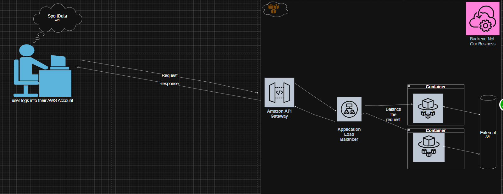
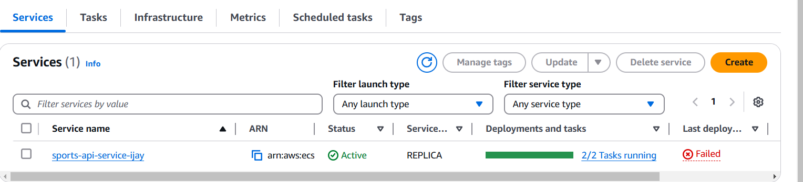
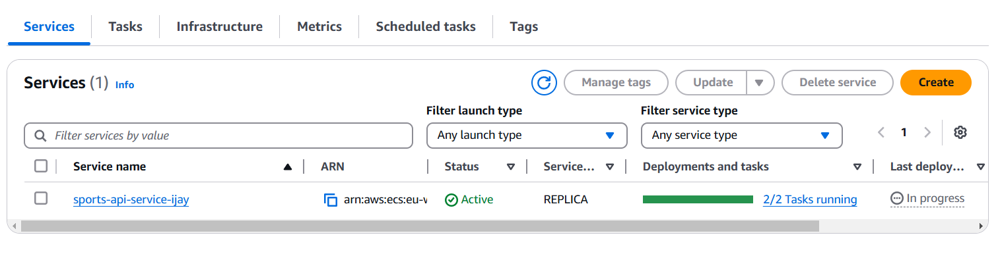

  
Table of Contents 

  <ol>
  <li><a href="#technical">Technical Architecture</a></li>
    Project</a>
        <ul>
          <li><a href="#about-the-project">About The Project</li>
          <li><a href="#last-project">Last Project</li>
          <li><a href="#current-project">Current Project</li>
          <li><a href="#overview">Overview</a></li>
          <li><a href="#key-features">Key Features</a></li>
        </ul>
    </li>
  <ul>
    <li><a href="#built-with">Built With</a></li>
    <li><a href="#technologies-used">Technologies Used</a></li>
    <li><a href="#challenges">Challenges</a></li>
    <li><a href="#solution">Solution</a></li>
  </ul>

# Containerized Sports API Management System

## Technical Architecture 

# About the project  

## Last Project 
 
I created an event-driven notification app to fetch NBA data and gain a better understanding of AWS Lambda, SNS, and EventBridge. You can check out the project here: [Project Link](https://github.com/ijayhub/game-day-notifications-aws). 

---

(<a href="#top">back to top</a>)

## Current Project

Today, I am building a **containerized management system** that uses Docker as a Orchestration tools for storing code, dependencies, and libraries. The system will query data while running the services in **AWS Fargate**. 

---

(<a href="#top">back to top</a>)

### Overview

* [Blog Documentation]()

(<a href="#top">back to top</a>)

## Key Features

- Fetching real-time data using a **REST API**. 

- Implementing **containerization** with Docker. 

- Creating a customized API route using **Amazon API Gateway**.

(<a href="#top">back to top</a>)

## Tech Stack  

### **Built With**

- **Amazon ECR (Elastic Container Registry)** – Helps with registering Docker images 

- **Amazon ECS (Elastic Container Service)** – Manages the creation of containers.

- **Amazon Fargate** – A serverless compute and runtime environment.  
- **Application Load Balancer (ALB)** – A type of **Elastic Load Balancer (ELB)** that distributes incoming traffic across multiple targets to ensure high availability and fault tolerance.

- **Amazon API Gateway** – Prevents direct user requests by providing a controlled access layer.

- **[SerpAPI](https://serpapi.com/)** – Used to fetch **NFL** data for users. 
--- 

## **Technologies Used**

- **Cloud Provider**: AWS

- **Core Services**: Amazon ECS (Fargate), API Gateway, CloudWatch.

- **Programming Language**: Python 3.x.

- **Containerization**: Docker.

---

(<a href="#top">back to top</a>)

### Challenges

I faced a challenge while creating a second cluster, service, and task. The deployment kept failing.

(<a href="#top">back to top</a>)

### Solution

If you look closely, the service box was unchecked, so I checked it and used force deployment, which resolved the issue and allowed it to run normally.

The success picture above shows it in progress. Just give it some time, and it will be **complete**.  

With this, I am able to query the data.

(<a href="#top">back to top</a>)

